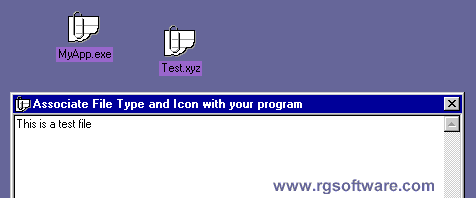



## Associate file type and icon with your app

### Description

I made some improvements on the code I submitted way back on 12/20/1998 (WOW! today is 12/20/2001 - its been 3 years to the day! My, how time flys!)

There has been about 11,000 downloads and a lot of comments on this code since then so I thought that an improvement should be posted.

I've added a SHChangeNotify function to update the icon in Windows immediately.

Original post: For those of you who want to add a touch of professionalism to your program, now you can create a file type in the Windows Registry database which will associate all files ending with your program's file extension (yourfile.xxx) to your program. You also specify an icon for your file type and a description. This example also shows you how to use Command$ to open these files in your program once the file is clicked or opened in Windows, and a quick tip on creating files in the Windows Recent file folder (Start > Documents).

Email rgardner@rgsoftware.com if you need help. Good luck.
 
### More Info
 

             |
---                |---
**Submitted On**   |2001-12-21 20:24:02
**By**             |[RGSoftware](https://github.com/Planet-Source-Code/PSCIndex/blob/master/ByAuthor/rgsoftware.md)
**Level**          |Beginner
**User Rating**    |4.9 (64 globes from 13 users)
**Compatibility**  |VB 4\.0 \(16\-bit\), VB 4\.0 \(32\-bit\), VB 5\.0, VB 6\.0, VBA MS Excel
**Category**       |[Registry](https://github.com/Planet-Source-Code/PSCIndex/blob/master/ByCategory/registry__1-36.md)
**World**          |[Visual Basic](https://github.com/Planet-Source-Code/PSCIndex/blob/master/ByWorld/visual-basic.md)
**Archive File**   |[Associate\_4350512212001\.zip](https://github.com/Planet-Source-Code/rgsoftware-associate-file-type-and-icon-with-your-app__1-29998/archive/master.zip)

